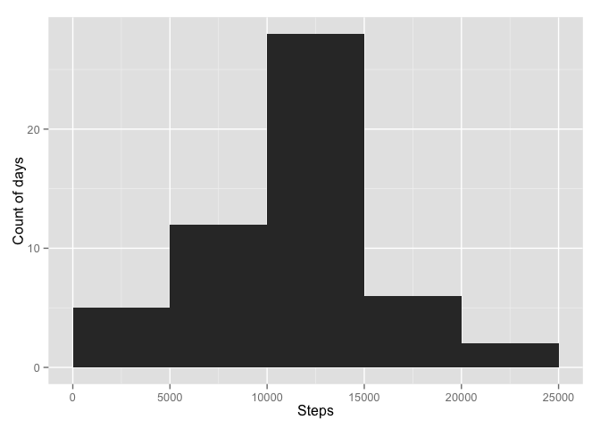
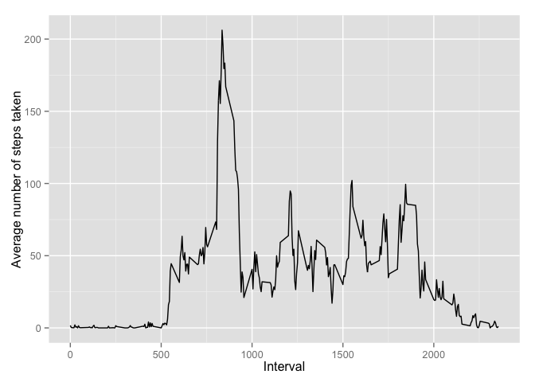
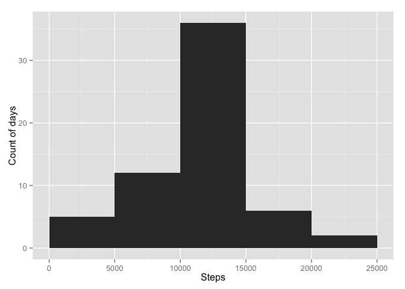
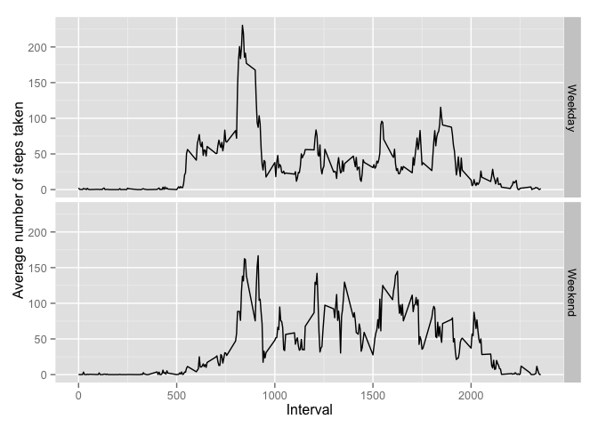

# Reproducible Research: Peer Assessment 1

This assignment makes use of data from a personal activity monitoring
device. This device collects data at 5 minute intervals through out the
day. The data consists of two months of data from an anonymous
individual collected during the months of October and November, 2012
and include the number of steps taken in 5 minute intervals each day.

The [data](https://d396qusza40orc.cloudfront.net/repdata%2Fdata%2Factivity.zip) includes
the following variables:

- **steps**: Number of steps taking in a 5-minute interval (missing
    values are coded as `NA`)

- **date**: The date on which the measurement was taken in YYYY-MM-DD
    format

- **interval**: Identifier for the 5-minute interval in which
    measurement was taken

### Loading and preprocessing the data


```r
library(data.table)
library(dplyr)
library(ggplot2) #load ggplot2
```


```r
setwd("/Users/pelayogonzalez/Desktop/Coursera/Reproducible_research/RepData_PeerAssessment1")
dt <- data.table(read.csv("activity.csv")) #Load as data.table
```

### What is mean total number of steps taken per day?

First let's plot the total number of steps taken each day.

```r
#Create new dt where steps are aggregated by day using dplyr
dt.by_day <- 
        dt %>% 
        filter(steps!= "NA") %>%
        group_by(date) %>% #Group by day
        summarize(steps_tot = sum(steps)) #Sum total steps by day no NAs

#Compute average and median steps by day
avg.steps.byday <- mean(dt.by_day$steps_tot) #Compute mean total number steps by day
med.steps.byday <- median(dt.by_day$steps_tot) #Compute median total number steps by day

#Plot steps taken each day
p1 <- ggplot(dt.by_day, aes(x = steps_tot)) #create plot
p1 +  geom_histogram(binwidth = 5000, origin = 0) + #format histogram
  labs(x = "Steps", y= "Count of days")
```

 

```r
# ggsave(file = "./instructions_fig/p1.png")
```

The mean and median total number of steps taken per day are 1.0766 &times; 10<sup>4</sup> and 10765, respectively.


### What is the average daily activity pattern?


```r
#Create new dt where steps are aggregated by interval using dplyr
dt.by_interval <- 
        dt %>% 
        filter(steps!= "NA") %>%
        group_by(interval) %>% #Group by day
        summarize(steps_avg = mean(steps)) #Sum total steps by day no NAs

#Plot steps taken each interval
p2 <- ggplot(dt.by_interval, aes(x = interval, y = steps_avg)) #create plot
p2 +  geom_line() + #format histogram 
  labs(x = "Interval", y= "Average number of steps taken")
```

 

```r
#Find interval with highest number of steps
max.steps <- dt.by_interval[which.max(dt.by_interval$steps_avg),] #Find row with maximum
highest.int <- max.steps[1,interval] #Extract value of interval
```

The maximum number of steps, on average across all days on dataset, is contained in interval 835.

### Imputing missing values


```r
#Compute number of missing values
missing <- length(which(is.na(dt))) 
#Create a new dt where missing will be replaced
dt.nomis <- dt #duplicate dt data table
steps.nomis <- ifelse(!is.na(dt.nomis$steps), dt.nomis$steps, dt.by_interval$steps_avg) #create a vector that replaces NAs by
dt.nomis$steps <- steps.nomis
```
The total number of missing values is  `missing`.

Missing values in the `steps` variable are replaced by the mean for the 5 minute interval computed previously. This modification is stored in `dt.nomissing`.


```r
#Create new dt where steps are aggregated by day using dplyr
dt.nomis.by_day <- 
        dt.nomis %>% 
        filter(steps!= "NA") %>%
        group_by(date) %>% #Group by day
        summarize(steps_tot = sum(steps)) #Sum total steps by day no NAs
#Compute average and median steps by day
avg.steps.nomis.byday <- mean(dt.nomis.by_day$steps_tot) #Compute mean total number steps by day
med.steps.nomis.byday <- median(dt.nomis.by_day$steps_tot) #Compute median total number steps by day
#Compute differences between origina dt and transformed one
diff.mean <- avg.steps.byday - avg.steps.nomis.byday
diff.med <- med.steps.byday - med.steps.nomis.byday
#Plot new dt
p3 <- ggplot(dt.nomis.by_day, aes(x = steps_tot)) #create plot
p3 +  geom_histogram(binwidth = 5000, origin = 0) + #format histogram
  labs(x = "Steps", y= "Count of days")
```

 

In the transformed database where missing values where replaced, the mean and median total number of steps taken per day are 1.0766 &times; 10<sup>4</sup> and 1.0766 &times; 10<sup>4</sup>. In this case differences in mean and median between the original database and the one where NAs were removed are 0 and -1.1887, respectively. Mean remains unchanged and there is a small difference in media. 

### Are there differences in activity patterns between weekdays and weekends?


```r
#Manipulate data to create a factor
dt.nomis$dow <- as.factor(weekdays(as.Date(dt$date))) #Obtain days of week
#Transform dow to another factor variable that takes two values
dt.nomis$daytype <- ifelse(dt.nomis$dow %in% c("sábado", "domingo"), "Weekend","Weekday")
dt.nomis <- transform(dt.nomis, day=factor(daytype))

#Use aggregate instead of dplyr functions
dt.nomis.by_interval <-  aggregate(steps ~ interval + day, dt.nomis, mean)
#Plot trends in steps taken faceting by day
p4 <- ggplot(dt.nomis.by_interval, aes(x = interval, y = steps)) #create plot
p4 +  geom_line() + #format histogram 
        facet_grid(day ~ .) +
  labs(x = "Interval", y= "Average number of steps taken") 
```

 

According to the plot the number of steps taken between interval 500 and 750 are larger, on average, during weekdays. It seems that the person under study walks more steps in the interval from 750 to 1750.

